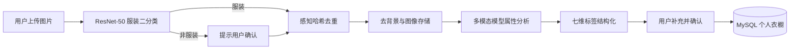
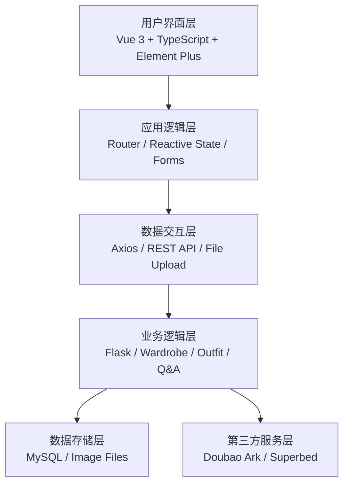

# 基于大语言模型的服饰穿搭智能推荐系统

Smart Wardrobe Recommender 是一个面向个人已有衣物的智能衣橱与穿搭问答系统。它不以电商商品推荐为中心，而是将用户上传的衣物组织成实时变化的个人服装知识库，再通过图像识别、结构化标签与多模态大模型，完成衣物管理、数据可视化、穿搭创建和个性化问答。

> 本项目源自计算机科学与技术本科毕业设计《基于语言大模型的服饰穿搭智能推荐系统》。

## 项目特点

- **个人动态知识库**：衣物随用户的上传、编辑和删除实时变化，问答始终基于当前衣橱。
- **上传质量控制**：自训练 ResNet-50 二分类模型过滤非服装图片，感知哈希与汉明距离用于识别相似图片。
- **统一服装语义**：以电商筛选维度和穿搭理论为参考，建立七维服装标签体系，将图像转换为可检索的结构化属性。
- **多模态穿搭问答**：支持纯文本问题、选中衣橱衣物提问，以及附加新图片的图文混合问题。
- **意图化提示工程**：针对搭配咨询、信息查询和单品评价设计不同策略，将回答范围限制在用户选中的衣物中。

## 核心功能

| 模块 | 功能 |
| --- | --- |
| 用户登录 | 注册、登录与用户数据隔离 |
| 我的数据 | 衣物总数、当月新增、穿搭次数、类别/季节/风格分布等可视化 |
| 虚拟衣柜 | 衣物上传、AI 属性分析、搜索筛选、编辑与删除 |
| 服装问答 | 结合所选衣物、文本和附加图片生成穿搭建议 |
| 穿搭管理 | 选择上下装、预览效果、保存、修改与删除穿搭 |

## 知识库构建流程



标签体系包含**类别、主色调、风格、厚度、场合、面料和季节**七个主维度，并使用子类别与具体颜色进一步细化。AI 先生成可编辑属性，用户确认后才写入数据库。

## 系统架构



智能问答部分另外划分为用户交互、业务逻辑、服装知识库和 AI 推理四个核心层次。后端会将用户问题、所选衣物属性、衣物图片和可选附件整合为结构化上下文，再调用多模态模型生成文本或图文混合回答。

## 服装二分类模型

论文实验使用了 7,440 张服装图片与 1,082 张非服装图片。非服装数据覆盖科技、自然风景、动物、食物和建筑五类，数据按 90% / 5% / 5% 划分为训练集、验证集和测试集。

- 基础网络：ImageNet 预训练 ResNet-50
- 任务头：Dropout 0.3 + 两类全连接层
- 预处理：224 x 224 缩放与 ImageNet 归一化
- 数据增强：水平翻转、旋转、仿射变换、颜色抖动和透视变换
- 训练策略：交叉熵损失与早停，论文记录于第 8 轮触发早停

### 论文实验结果

| 指标 | 结果 |
| --- | ---: |
| 测试集样本 | 436 |
| 服装样本召回率 | 378 / 382 = 98.95% |
| 非服装样本正确识别率 | 54 / 54 = 100% |
| 总体准确率 | 432 / 436 = 99.08% |
| ROC AUC | 1.00 |

> 以上数据来自毕业论文中的实验记录与混淆矩阵。当前仓库包含推理权重，不包含训练数据与完整训练脚本。

## 技术栈

| 领域 | 技术 |
| --- | --- |
| 前端 | Vue 3、TypeScript、Vite、Element Plus、ECharts、Axios、html2canvas |
| 后端 | Flask、PyMySQL、OpenCV、Pillow、rembg |
| 模型 | PyTorch、TorchVision、ResNet-50、火山方舟豆包多模态模型 |
| 数据 | MySQL、感知哈希、Superbed 图像存储 |

## 目录结构

```text
.
├── backend/
│   ├── app.py                  # Flask API、图像处理与模型推理
│   ├── requirements.txt        # Python 依赖
│   └── static/                 # 运行时图片，不提交
├── database/
│   └── schema.sql              # MySQL 建表脚本
├── frontend/
│   ├── public/
│   ├── src/                    # Vue 页面、路由和组件
│   ├── package.json
│   └── vite.config.ts
├── models/
│   └── final_model_*.pth       # 服装二分类模型权重
├── .env.example                # 配置模板
└── README.md
```

## 本地运行

### 1. 准备环境

建议使用 Node.js 20+、Python 3.10 和 MySQL 8.0。

```bash
git clone https://github.com/gaolaotou1/smart-wardrobe-recommender.git
cd smart-wardrobe-recommender

conda create -n smart-wardrobe python=3.10 -y
conda activate smart-wardrobe
pip install -r backend/requirements.txt

cd frontend
npm install
cd ..
```

macOS Apple Silicon 如果安装 PyTorch 时出现兼容问题，请按 [PyTorch 官方安装页](https://pytorch.org/get-started/locally/) 选择当前平台命令。

### 2. 初始化 MySQL

```bash
mysql -u root -p -e "CREATE DATABASE IF NOT EXISTS fashion_system CHARACTER SET utf8mb4 COLLATE utf8mb4_general_ci;"
mysql -u root -p fashion_system < database/schema.sql
```

首次启动后可在登录页注册新账号。

### 3. 配置环境变量

```bash
cp .env.example .env
```

前后端共用项目根目录的 `.env`：

| 变量 | 用途 |
| --- | --- |
| `VITE_API_BASE_URL` | 前端访问的 Flask API 地址 |
| `FLASK_HOST` / `FLASK_PORT` | Flask 监听地址与端口 |
| `DB_HOST` / `DB_PORT` | MySQL 地址与端口 |
| `DB_USER` / `DB_PASSWORD` | MySQL 用户名与密码 |
| `DB_NAME` | 数据库名称 |
| `ARK_API_URL` / `ARK_API_TOKEN` | 火山方舟多模态 API |
| `ARK_MODEL` | 豆包模型 ID |
| `SUPERBED_UPLOAD_URL` / `SUPERBED_TOKEN` | 图像存储服务 |
| `CLOTHES_MODEL_PATH` | PyTorch 模型权重路径 |

`.env` 已被 Git 忽略，`.env.example` 只包含可公开的配置模板。未配置外部 API 时，基础登录、衣橱查询和数据统计仍可使用，AI 属性分析、图床上传和穿搭问答需要相应 Token。

### 4. 启动后端

```bash
python backend/app.py
```

默认 API 地址为 `http://127.0.0.1:8088`。第一次启动时，`rembg` 可能会下载去背景模型。

### 5. 启动前端

```bash
cd frontend
npm run dev
```

浏览器访问 `http://127.0.0.1:5173`。

## 主要 API

| 方法 | 路径 | 说明 |
| --- | --- | --- |
| `POST` | `/api/register` | 注册用户 |
| `POST` | `/api/login` | 用户登录 |
| `GET/POST` | `/api/clothes` | 查询或新增衣物 |
| `PUT/DELETE` | `/api/clothes/:id` | 更新或删除衣物 |
| `POST` | `/api/upload` | 衣物验证、去重、去背景与属性分析 |
| `POST` | `/api/recommend` | 多模态穿搭问答 |
| `GET/POST` | `/api/outfits` | 查询或创建穿搭 |
| `GET` | `/api/dashboard` | 仪表盘统计数据 |

## 构建与检查

```bash
cd frontend
npm run build

cd ..
python -m py_compile backend/app.py
```

## 已知限制

- 当前账号体系主要用于本地演示，密码未使用强哈希存储，不应直接用于生产环境。
- 图片和问答内容会发送到所配置的第三方图床与多模态 API，请留意数据隐私与服务配额。
- 仓库包含约 90 MB 的模型权重。如果频繁更新模型，建议迁移到 Git LFS 或 GitHub Releases。
- 论文中的实验数据来自特定数据集，不代表所有拍摄条件下的泛化表现。

## License

本项目目前未声明开源许可证。未经作者允许，不得将代码用于商业目的。
